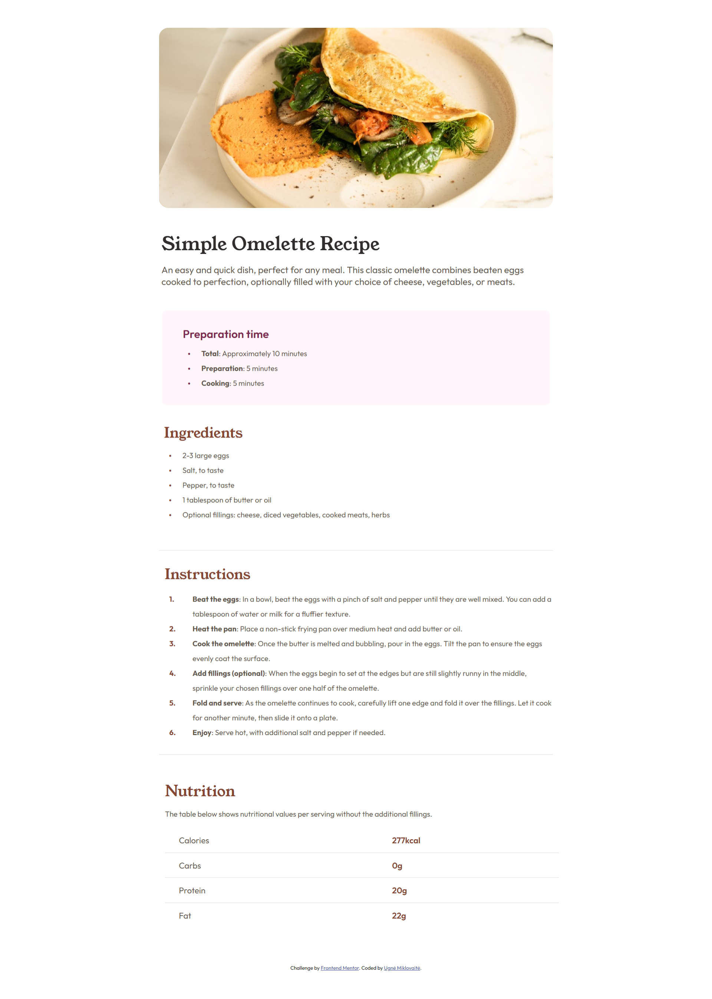
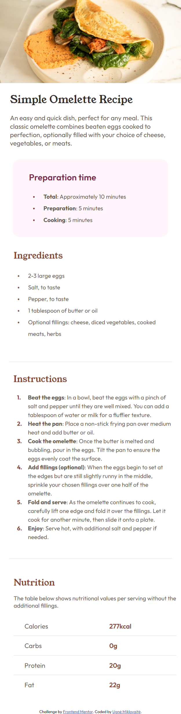

# Recipe Page Project

This is a responsive recipe page built with semantic HTML and CSS. The project was designed as part of a Frontend Mentor challenge and focuses on creating a clean, accessible layout. The page includes a detailed recipe section with steps, ingredients, and images, ensuring an easy-to-follow structure for users on any device.

## Features:
- Fully responsive design using media queries
- Semantic HTML for better accessibility
- Clean and modern layout

## Screenshots:

### Desktop View:

### Mobile View:

Feel free to explore and suggest improvements!
